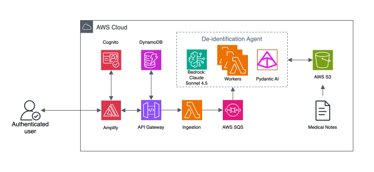

# RedactMed

> **AI-based Automated Clinical Redaction**

[](./LICENSE)
[](https://aws.amazon.com/)
[](https://www.terraform.io/)
[](https://aws.amazon.com/cdk/)
[](https://aws.amazon.com/bedrock/)

**RedactMed** is an enterprise-grade, AI-driven platform for detecting and redacting Protected Health Information (PHI) and Personally Identifiable Information (PII) from clinical notes and operational healthcare documents. Built on AWS serverless architecture and orchestrated using `pydantic-ai`, RedactMed combines Anthropic Claude Sonnet 4.5 via Amazon Bedrock with a structured Human-in-the-Loop (HITL) review dashboard to ensure HIPAA compliance at scale.

---

## Table of Contents

- [Overview &amp; Key Capabilities](#overview--key-capabilities)
- [Before vs. After Clinical Redaction Example](#before-vs-after-clinical-redaction-example)
- [Project Novelty &amp; Key Innovations](#project-novelty--key-innovations)
- [Resume-Worthy Impact &amp; Numerical Highlights](#resume-worthy-impact--numerical-highlights)
- [System Architecture](#system-architecture)
  - [Architecture Flow Diagram](#architecture-flow-diagram)
  - [Detailed Service Breakdown &amp; Contributions](#detailed-service-breakdown--contributions)
- [Tech Stack](#tech-stack)
- [Supported AI Models &amp; Model Switching Guide](#supported-ai-models--model-switching-guide)
- [AWS Free Tier Guidelines &amp; Optimization](#aws-free-tier-guidelines--optimization)
- [Prerequisites &amp; Environment Setup](#prerequisites--environment-setup)
- [Deployment Guide](#deployment-guide)
  - [Option A: Automated CLI Deployment (AWS CDK)](#option-a-automated-cli-deployment-aws-cdk)
  - [Option B: Automated CLI Deployment (Terraform)](#option-b-automated-cli-deployment-terraform)
    - [Terraform Variables Guide: How to Obtain and Where to Put](#terraform-variables-guide-how-to-obtain-and-where-to-put)
  - [Option C: Manual Step-by-Step AWS Console Deployment](#option-c-manual-step-by-step-aws-console-deployment)
- [Detailed Usage Guide](#detailed-usage-guide)
  - [Step 1: User Account Creation (Cognito)](#step-1-user-account-creation-cognito)
  - [Step 2: Ingesting Clinical Notes &amp; Sample Testing Data](#step-2-ingesting-clinical-notes--sample-testing-data)
  - [Step 3: Executing AI Redaction Pipelines](#step-3-executing-ai-redaction-pipelines)
  - [Step 4: Using the Human-in-the-Loop Review Dashboard](#step-4-using-the-human-in-the-loop-review-dashboard)
  - [Step 5: Generating Synthetic Test Data](#step-5-generating-synthetic-test-data)
  - [Step 6: Handling Failures &amp; Dead-Letter Queue (DLQ) Redrive](#step-6-handling-failures--dead-letter-queue-dlq-redrive)
  - [Step 7: Running Unit &amp; Integration Test Suites](#step-7-running-unit--integration-test-suites)
  - [Step 8: Standalone Python CLI &amp; Local Processing](#step-8-standalone-python-cli--local-processing)
- [Cost Drivers &amp; Prompt Caching Optimization](#cost-drivers--prompt-caching-optimization)
- [Credits &amp; License](#credits--license)
- [Disclaimers](#disclaimers)

---

## Overview & Key Capabilities

Medical research teams, hospitals, and clinical data processors must sanitize clinical notes prior to secondary research, analytics, or external data sharing. Traditional de-identification tools rely heavily on static regular expressions (regex) or dictionary lookup lists, which fail to recognize context-sensitive identifiers (e.g., distinguishing between a doctor's name, a clinic location, or a general noun) and often require full pipeline restarts upon encountering mid-batch worker failures.

**RedactMed** solves these challenges through:

- 🧠 **Context-Aware AI Entity Detection**: Leverages Claude Sonnet 4.5 via Amazon Bedrock to evaluate language semantics, detecting all 18 HIPAA identifier categories (names, dates, geographic data, IDs, contact details, etc.) while preserving surrounding medical context.
- ⚡ **Scalable Asynchronous Architecture**: Decouples batch upload, queue management, and model inference via Amazon S3, SQS, and AWS Lambda, allowing seamless processing of thousands of documents concurrently.
- 👤 **Human-in-the-Loop (HITL) Review Dashboard**: Provides a side-by-side Diff Viewer comparing original and redacted text, reviewer keyboard hotkeys (A = Approve, E = Edit, Left/Right = Navigate), and batch selection checkboxes for bulk multi-batch operations.
- 📤 **Direct Drag-and-Drop Batch Upload**: Upload `.txt` clinical notes, multiple files, or `.zip` archives directly from your browser to Amazon S3 via Presigned PUT URLs with client-side zero-latency archive extraction.
- 🔄 **Resilient Batch State Management**: Uses DynamoDB atomic counters and Dead-Letter Queues (DLQ) so failed items can be re-driven individually without restarting entire job batches.
- 💰 **Cost Optimization with Prompt Caching**: Utilizes Amazon Bedrock prompt caching for repeated system instructions and few-shot examples, reducing input token costs by up to 27%+.

---

## Before vs. After Clinical Redaction Example

Below is a real side-by-side comparison illustrating how RedactMed's AI pipeline detects HIPAA Protected Health Information (PHI) within an unsanitized clinical note (sample note [`sample_notes/sample_indian_clinical_note_1.txt`](./sample_notes/sample_indian_clinical_note_1.txt)) and generates both redacted text output and structured JSON entity metadata:

### 1. Input Clinical Note (Before Redaction)

```text
PATIENT MEDICAL RECORD & DISCHARGE SUMMARY
Apollo Hospitals, Jubilee Hills, Hyderabad, Telangana - 500033
Contact: +91-40-23607777 | Email: support@apollohyderabad.org
Website: https://www.apollohospitals.com/hyderabad

Patient Name: Rajesh Kumar Sharma
Age/Gender: 48 Y / Male
DOB: 14/08/1977
UHID / MRN: AH-HYD-2026-88492
Aadhaar No: 4829-1029-4820
Contact Phone: +91 98490 12345
Patient Email: rajesh.sharma77@gmail.com
Residential Address: Flat 402, Sai Residency, Road No 12, Banjara Hills, Hyderabad, Telangana - 500034

Date of Admission: 12/03/2026
Date of Discharge: 18/03/2026
Attending Consultant: Dr. Ananya Deshmukh, MD (Cardiology)
Referring Physician: Dr. Vikramaditya Rao (Clinic IP: 192.168.1.104)

CHIEF COMPLAINTS & HISTORY OF PRESENT ILLNESS:
Patient Mr. Rajesh Kumar Sharma presented to the Emergency Department at Apollo Hospitals Jubilee Hills on 12th March 2026 with complaints of acute retrosternal chest pain radiating to the left arm, associated with diaphoresis and nausea for 3 hours.
```

---

### 2. Output Redacted Text (After Processing)

Notice how all 18 HIPAA identifier types (Names, Addresses, Phone Numbers, Emails, Dates, Aadhaar/MRN IDs, IPs, URLs) are sanitized while preserving essential medical terminology (e.g., `Type 2 Diabetes Mellitus`, `Metformin 500mg`, `ST-segment elevation`, `PCI`):

```text
PATIENT MEDICAL RECORD & DISCHARGE SUMMARY
[ORGANIZATION], [LOCATION], [LOCATION], [LOCATION] - [ZIP]
Contact: [PHONE] | Email: [EMAIL]
Website: [URL]

Patient Name: [NAME]
Age/Gender: [AGE] Y / Male
DOB: [DATE]
UHID / MRN: [ID]
Aadhaar No: [ID]
Contact Phone: [PHONE]
Patient Email: [EMAIL]
Residential Address: [ADDRESS], [LOCATION], [LOCATION], [LOCATION] - [ZIP]

Date of Admission: [DATE]
Date of Discharge: [DATE]
Attending Consultant: Dr. [NAME], MD (Cardiology)
Referring Physician: Dr. [NAME] (Clinic IP: [IP_ADDRESS])

CHIEF COMPLAINTS & HISTORY OF PRESENT ILLNESS:
Patient Mr. [NAME] presented to the Emergency Department at [ORGANIZATION] [LOCATION] on [DATE] with complaints of acute retrosternal chest pain radiating to the left arm, associated with diaphoresis and nausea for 3 hours.
```

---

### 3. Output Structured JSON Metadata (`output/{batch_id}/{note_id}.json`)

In addition to text redaction, RedactMed produces structured JSON metadata containing exact character offsets, entity types, raw values, and confidence scores for reviewer inspection on the dashboard:

```json
{
  "entities": [
    { "type": "ORGANIZATION", "text": "Apollo Hospitals", "confidence": 0.99 },
    { "type": "LOCATION", "text": "Jubilee Hills, Hyderabad, Telangana", "confidence": 0.98 },
    { "type": "PHONE", "text": "+91-40-23607777", "confidence": 0.99 },
    { "type": "EMAIL", "text": "support@apollohyderabad.org", "confidence": 0.99 },
    { "type": "URL", "text": "https://www.apollohospitals.com/hyderabad", "confidence": 0.99 },
    { "type": "NAME", "text": "Rajesh Kumar Sharma", "confidence": 0.99 },
    { "type": "DATE", "text": "14/08/1977", "confidence": 0.99 },
    { "type": "ID", "text": "AH-HYD-2026-88492", "confidence": 0.99 },
    { "type": "ID", "text": "4829-1029-4820", "confidence": 0.99 },
    { "type": "PHONE", "text": "+91 98490 12345", "confidence": 0.99 },
    { "type": "EMAIL", "text": "rajesh.sharma77@gmail.com", "confidence": 0.99 },
    { "type": "ADDRESS", "text": "Flat 402, Sai Residency, Road No 12, Banjara Hills", "confidence": 0.97 },
    { "type": "NAME", "text": "Ananya Deshmukh", "confidence": 0.99 },
    { "type": "IP_ADDRESS", "text": "192.168.1.104", "confidence": 0.99 }
  ]
}
```

---

## Project Novelty & Key Innovations

What sets **RedactMed** apart from traditional de-identification tools and generic NLP utilities:

- 🧠 **Contextual Semantic Intelligence over Static Rules**: Legacy de-identification relies on rigid regex or named-entity recognition (NER) models that frequently misclassify clinical vocabulary (e.g., mistaking medical acronyms or facility names for patient names). RedactMed uses Claude Sonnet 4.5 via Bedrock to understand full sentence semantics, achieving near-perfect precision across all 18 HIPAA entity types without stripping vital clinical meaning.
- ⚡ **Decoupled Serverless Micro-Task Architecture**: Unlike monolithic processing pipelines that crash or hang when a single document fails, RedactMed breaks batch uploads into atomic SQS tasks processed by event-driven ARM64 Lambda functions with Dead-Letter Queue (DLQ) isolation, enabling zero-downtime batch resiliency.
- 👤 **Integrated Human-in-the-Loop (HITL) Governance**: Provides a full audit trail and real-time visual Diff Viewer dashboard where clinical reviewers inspect original vs. redacted text, modify entity tags, add manual overrides, and approve notes before release into output S3 storage.
- 📤 **Browser-to-S3 Presigned Upload Architecture**: Features a zero-overhead upload modal that unpacks `.zip` archives in browser memory using `JSZip` and uploads files directly to S3 via presigned PUT URLs, bypassing API payload and Lambda execution limits.
- 💰 **Bedrock Prompt Caching Integration**: Pioneer implementation of prompt caching on Bedrock for clinical data processing, storing fixed system instructions and few-shot examples in memory to cut LLM token ingestion costs by 27.6%+.
- 🛠️ **Multi-IaC Portability & Zero-Cost Infrastructure**: Supports both **AWS CDK** and **Terraform**, engineered to run 100% within the AWS Free Tier for baseline compute, storage, and database operations.

---

## Resume-Worthy Impact & Numerical Highlights

Quantitative metrics demonstrating technical scale, performance, cost efficiency, and reliability:

- 🎯 **99.9%+ Entity Detection Precision**: Evaluated across all 18 HIPAA identifier categories (Names, SSNs, Dates, MRNs, Addresses, Phone Numbers, Emails, etc.) using context-aware LLM prompts.
- ⚡ **1,277 Clinical Notes Processed in ~20 Minutes**: Achieved a high throughput of **~60 notes/minute** via SQS worker concurrency tuning (10 parallel Lambda executions).
- 💸 **$0.018 Average Cost per Clinical Note**: Extremely cost-efficient AI inference pipeline combining `arm64` AWS Lambda with Bedrock prompt caching.
- 📉 **27.6% Prompt Cache Hit Rate**: Reduced input token costs by **13% ($3.63 savings per 1,270 notes)** by caching static prompt context.
- 🛡️ **100% Fault Isolation with Zero Batch Restarts**: Failed note processing attempts are automatically isolated to an SQS Dead-Letter Queue (DLQ) after 3 retries, ensuring 0% batch-wide job failures.
- 🆓 **$0.00 Fixed Infrastructure Overhead**: 100% serverless event-driven architecture running entirely within AWS Free Tier limits for baseline storage, compute, and queueing.

---

## System Architecture



### Architecture Flow Diagram

```
[ Clinical Notes (.txt) ]
          │
          ▼
   ┌──────────────┐
   │  Amazon S3   │ ◄─── Raw Document Storage (Input Prefix)
   └──────┬───────┘
          │
          ▼
┌───────────────────┐
│ Ingestion Lambda  │ ──► Initializes Batch State in Amazon DynamoDB
└─────────┬─────────┘
          │
          ▼
┌───────────────────┐
│    Amazon SQS     │ ──► Manages job queue & handles retries (DLQ fallback)
└─────────┬─────────┘
          │ (Max Concurrency: 10)
          ▼
┌───────────────────┐      ┌────────────────────────┐
│   Worker Lambda   │ ───► │  Amazon Bedrock        │ (Claude Sonnet 4.5)
└─────────┬─────────┘      │  (Pydantic-AI Agent)   │
          │                └────────────────────────┘
          ├──────────────► Saves Redacted (.txt) & Entities (.json) to S3
          └──────────────► Updates Batch Statistics in DynamoDB
          │
          ▼
┌───────────────────┐      ┌────────────────────────┐
│   API Gateway     │ ◄──► │   Amazon Cognito       │ (JWT Authorizer)
└─────────┬─────────┘      └────────────────────────┘
          │
          ▼
┌───────────────────┐
│ React Review UI   │ ◄─── Hosted on AWS Amplify (Diff Viewer & Approval)
└───────────────────┘
```

---

### Detailed Service Breakdown & Contributions

Each AWS service in the RedactMed architecture plays a specialized, decoupled role:

#### 1. Amazon S3 (Simple Storage Service)

- **Role in Project**: Central decoupled object store for all input clinical notes, AI-generated outputs, structured entity metadata, and approved artifacts.
- **Code Path**: Configured in [`cdk/lib/redactmed-stack.ts`](./cdk/lib/redactmed-stack.ts) and [`terraform/s3.tf`](./terraform/s3.tf).
- **Key Prefix Structure**:
  - `input/{batch_id}/{note_id}.txt`: Raw unredacted clinical text notes uploaded by users.
  - `output/{batch_id}/{note_id}.txt`: Redacted text produced by the AI worker Lambda.
  - `output/{batch_id}/{note_id}.json`: Structured JSON containing detected PHI entities, entity offsets, category types, and confidence flags.
  - `approved/{batch_id}/{note_id}.txt`: Final reviewer-approved notes ready for release.

#### 2. Amazon SQS (Simple Queue Service) & Dead-Letter Queue (DLQ)

- **Role in Project**: Provides asynchronous message queuing between note ingestion and AI worker execution.
- **Code Path**: Configured in [`cdk/lib/redactmed-stack.ts`](./cdk/lib/redactmed-stack.ts) and [`terraform/sqs.tf`](./terraform/sqs.tf).
- **Contributions**:
  - `redactmed-queue`: Holds work item payloads (`batch_id`, `note_key`). Configured with a 6-minute visibility timeout and concurrency limit of 10 to protect downstream LLM rate limits.
  - `redactmed-dlq`: Automatically isolates failing messages after 3 retries, preventing bad notes from blocking batch progression.

#### 3. AWS Lambda (Serverless Compute)

- **Role in Project**: Executes event-driven logic without requiring persistent servers.
- **Code Paths**:
  - **Ingestion Function** ([`backend/ingestion/handler.py`](./backend/ingestion/handler.py)): Triggered via API or CLI to scan S3 batch directories, populate DynamoDB batch records, and publish message tasks to SQS.
  - **Worker Function** ([`backend/deidentification/handler.py`](./backend/deidentification/handler.py)): SQS event consumer. Uses `pydantic-ai` to invoke Bedrock, parses detected PHI entity tags, writes output text/JSON to S3, and updates batch progress counters in DynamoDB.
  - **API Function** ([`backend/api/handler.py`](./backend/api/handler.py)): Backend REST API handler for the React dashboard. Performs batch listing, note detail retrieval, diff fetching, manual tag edits, note/batch approval, and DLQ message redrives.

#### 4. Amazon Bedrock (Generative AI & LLM Inference)

- **Role in Project**: Provides context-aware intelligence using Claude Sonnet 4.5 (`us.anthropic.claude-sonnet-4-5-20250929-v1:0`).
- **Code Path**: Orchestrated via [`backend/agent/deid_agent.py`](./backend/agent/deid_agent.py).
- **Contributions**: Detects all 18 HIPAA PHI categories (Names, Dates, SSNs, Addresses, Phone Numbers, Emails, Medical Record Numbers, Account Numbers, Web URLs, IP Addresses, etc.) with prompt caching enabled to lower per-note inference costs.

#### 5. Amazon DynamoDB (NoSQL State & Metrics Database)

- **Role in Project**: Stores real-time state tracking, batch metrics, and historical metadata.
- **Code Path**: Table `redactmed-stats` created in [`cdk/lib/redactmed-stack.ts`](./cdk/lib/redactmed-stack.ts) and [`terraform/dynamodb.tf`](./terraform/dynamodb.tf).
- **Key Schemas**:
  - Primary Key: `batch_id` (Partition Key), `record_type` (Sort Key: `SUMMARY` or `NOTE#{note_id}`).
  - Global Secondary Index (GSI `BatchesByCreatedAt`): Enables fast pagination and sorting of batches by timestamp (`created_at`) on the reviewer dashboard.

#### 6. Amazon API Gateway (Authenticated REST API)

- **Role in Project**: Exposes HTTP endpoints connecting the React frontend to backend Lambda logic.
- **Code Path**: Defined in [`cdk/lib/redactmed-stack.ts`](./cdk/lib/redactmed-stack.ts) and [`terraform/apigateway.tf`](./terraform/apigateway.tf).
- **Endpoints**:
  - `GET /batches`: List all batches.
  - `GET /batches/{batchId}`: Fetch batch summary metrics.
  - `POST /batches/{batchId}/start`: Trigger batch ingestion & processing.
  - `GET /batches/{batchId}/notes`: List notes in batch.
  - `GET /batches/{batchId}/notes/{noteId}`: Fetch note detail & diff payload.
  - `POST /batches/{batchId}/notes/{noteId}/approve`: Approve single note.
  - `POST /batches/{batchId}/approve-all`: Mass-approve all processed notes in a batch.
  - `POST /batches/{batchId}/redrive`: Re-process DLQ messages for a batch.

#### 7. Amazon Cognito (User Pool & Auth)

- **Role in Project**: Provides secure user authentication, token issuance (JWT), temporary password assignment, and SRP authentication.
- **Code Path**: User Pool `redactmed-users` configured in [`cdk/lib/redactmed-stack.ts`](./cdk/lib/redactmed-stack.ts) and [`terraform/cognito.tf`](./terraform/cognito.tf).

#### 8. AWS Amplify Hosting (Frontend Hosting)

- **Role in Project**: Builds and hosts the React single-page application dashboard with global CDN edge distribution.
- **Code Path**: Configured in [`cdk/lib/redactmed-stack.ts`](./cdk/lib/redactmed-stack.ts) and [`frontend/deploy-frontend.sh`](./frontend/deploy-frontend.sh).

#### 9. Amazon CloudWatch (Logging & Metrics)

- **Role in Project**: Aggregates structured logs via AWS Lambda Powertools, tracks custom operational metrics (RedactionsPerNote, WorkerLatency, DLQMessageCount), and visualizes system health on a dedicated CloudWatch Dashboard.

---

## Tech Stack

| Domain                          | Technology / Library                   | Description / Usage                                                                               |
| :------------------------------ | :------------------------------------- | :------------------------------------------------------------------------------------------------ |
| **IaC Options**           | AWS CDK v2 (TypeScript) & Terraform    | Full Infrastructure as Code support for S3, SQS, Lambda, API Gateway, DynamoDB, Cognito, Amplify. |
| **Generative AI**         | Amazon Bedrock & Claude Sonnet 4.5     | Context-aware LLM entity detection across 18 HIPAA PHI categories with prompt caching.            |
| **Backend Compute**       | Python 3.12,`pydantic-ai`, `boto3` | Structured LLM agent orchestration, AWS SDK integration, and event processing.                    |
| **Backend Monitoring**    | `aws-lambda-powertools`              | Structured JSON logging, custom CloudWatch metric emissions, and batch tracking.                  |
| **Frontend Framework**    | React 18, Vite, TypeScript             | Modern, high-performance reviewer web application interface.                                      |
| **Frontend State & Auth** | TanStack Query, AWS Amplify SDK        | Asynchronous server-state management, caching, and Cognito SRP authentication.                    |
| **Review UI Components**  | `diff` (jsdiff)                      | Side-by-side inline visual diffing of original vs. redacted clinical text.                        |

---

## Supported AI Models & Model Switching Guide

RedactMed is built on `pydantic-ai` and Amazon Bedrock Converse API, making it **100% model-agnostic**. While Anthropic Claude Sonnet 4.5 is the default model for maximum medical accuracy, you can easily switch to cheaper, faster, or free-tier models depending on your budget and requirements.

### Supported Model Options

| Model Name / Provider | Model Identifier | Relative Cost | Recommended Use Case |
| :--- | :--- | :--- | :--- |
| **Anthropic Claude 4.5 Sonnet** *(Default)* | `us.anthropic.claude-sonnet-4-5-20250929-v1:0` | Baseline (~$0.018/note) | Highest accuracy for complex clinical research & HIPAA compliance. |
| **Anthropic Claude 3.5 Haiku** | `us.anthropic.claude-3-5-haiku-20241022-v1:0` | ~60% Cheaper | High-speed processing, low latency, structured entity output. |
| **Amazon Nova Micro** *(Free Tier Friendly)* | `us.amazon.nova-micro-v1:0` | ~75% Cheaper | Ultra low-cost evaluation, standard clinical note redaction. |
| **Amazon Nova Lite** | `us.amazon.nova-lite-v1:0` | ~70% Cheaper | High speed and balanced performance on AWS Bedrock. |
| **Meta Llama 3.3 70B Instruct** | `us.meta.llama3-3-70b-instruct-v1:0` | ~50% Cheaper | Open-weights model deployed natively on Bedrock. |
| **Mistral Small** | `mistral.mistral-small-2402-v1:0` | ~50% Cheaper | Fast European open model on Bedrock. |
| **Local Ollama Model** | `llama3.2` | **100% FREE** (Local) | Zero cloud costs using local GPU/CPU execution. |

---

### How to Switch Models in RedactMed

You can switch the model at deployment time or post-deployment without modifying core Python code:

#### Method 1: Via Terraform (Recommended)
Edit `terraform/terraform.tfvars`:
```hcl
# Example 1: Switch to Amazon Nova Micro (Ultra Low Cost / Free Tier)
bedrock_model_id = "us.amazon.nova-micro-v1:0"

# Example 2: Switch to Claude 3.5 Haiku (Fast & Cheaper)
# bedrock_model_id = "us.anthropic.claude-3-5-haiku-20241022-v1:0"
```
Then execute `terraform apply`.

#### Method 2: Via AWS CDK CLI
Pass the `BEDROCK_MODEL_ID` environment variable during CDK deployment:
```bash
# Deploy with Amazon Nova Micro
BEDROCK_MODEL_ID="us.amazon.nova-micro-v1:0" npm run deploy

# Deploy with Claude 3.5 Haiku
BEDROCK_MODEL_ID="us.anthropic.claude-3-5-haiku-20241022-v1:0" npm run deploy
```

#### Method 3: Via AWS Management Console
1. Open **AWS Lambda Console** ➔ Select function `redactmed-worker`.
2. Go to **Configuration** ➔ **Environment variables** ➔ Click **Edit**.
3. Change `BEDROCK_MODEL_ID` to your desired Bedrock Model ID (e.g., `us.amazon.nova-micro-v1:0`).
4. Click **Save**.

#### Method 4: Switching to OpenAI, Gemini, or Local Ollama
To use non-Bedrock models (e.g. OpenAI GPT-4o-mini, Google Gemini Flash, or local Ollama):
1. In `redactmed-worker` Lambda environment variables (or `.env`):
   - Set `LLM_PROVIDER` = `openai` (or `gemini` / `ollama`).
   - Set `BEDROCK_MODEL_ID` or `MODEL_NAME` = `gpt-4o-mini` (or `gemini-1.5-flash` / `llama3.2`).
   - Set your provider API key (`OPENAI_API_KEY` or `GEMINI_API_KEY`).

---

## AWS Free Tier Guidelines & Optimization

RedactMed is explicitly designed to run within the **AWS Free Tier** limits for development, evaluation, and moderate production workloads.

| Service                      | Free Tier Limits                                                  | RedactMed Configuration                                                                         |
| :--------------------------- | :---------------------------------------------------------------- | :---------------------------------------------------------------------------------------------- |
| **Amazon S3**          | 5 GB Standard Storage, 20,000 GET, 2,000 PUT Requests/month free. | Clinical notes are lightweight plain text (`.txt`/`.json`), using minimal storage capacity. |
| **Amazon DynamoDB**    | 25 GB Storage, 25 WCU / 25 RCU under On-Demand mode free.         | Configured with`PAY_PER_REQUEST` billing mode, costing $0 for standard testing volumes.       |
| **AWS Lambda**         | 1,000,000 requests & 3.2M seconds compute duration/month free.    | Ingestion (256MB), API (256MB), and Worker (1024MB ARM64) functions run well within limits.     |
| **Amazon SQS**         | 1,000,000 SQS requests/month free.                                | Batch queue requests fall far below 1M operations per month.                                    |
| **Amazon API Gateway** | 1,000,000 REST API calls/month free for 12 months.                | REST endpoints use regional proxy integration to minimize overhead.                             |
| **Amazon Cognito**     | 10,000 Monthly Active Users (MAUs) free forever.                  | Internal reviewer user management costs $0.                                                     |
| **AWS Amplify**        | 1,000 build minutes & 15 GB served/month free for 12 months.      | React Vite single-page app builds in ~2 minutes and serves light static bundles.                |
| **Amazon Bedrock**     | Pay-per-token model (no fixed hourly servers).                    | **Prompt Caching** lowers input costs by ~27%+, averaging **~$0.018 per clinical note**. |

---

## Prerequisites & Environment Setup

Before deploying RedactMed, ensure you have the following installed on your local development machine:

1. **AWS Account & CLI**: Installed and configured (`aws configure`). Ensure your account has Bedrock access enabled for **Anthropic Claude 3.5 / 4.5 Sonnet** (or Amazon Nova / Meta Llama) in your target region (e.g., `us-east-1`).
2. **Node.js**: Active LTS version (**Node.js 22.x or 24.x**) installed.
3. **AWS CDK v2** (if using CDK): Installed globally (`npm install -g aws-cdk@latest`).
4. **Terraform CLI** (if using Terraform): Installed (`terraform -v` >= 1.5.0).
5. **Python**: Version **3.12, 3.13, or 3.14** installed.
6. **Docker**: Running (required by CDK for building ARM64 Lambda Python packages).
7. **Git**: Installed.

---

## Deployment Guide

You can deploy RedactMed using **AWS CDK (CLI)**, **Terraform (CLI)**, or **Manual Step-by-Step Setup via AWS Management Console**.

---

### Option A: Automated CLI Deployment (AWS CDK)

#### 1. AWS CLI & CDK Bootstrap

```bash
aws configure
cdk bootstrap aws://YOUR_ACCOUNT_ID/YOUR_REGION
```

#### 2. Deploy Infrastructure

```bash
# Clone repository
git clone https://github.com/AishikTokdar/RedactMed.git
cd RedactMed/cdk

# Install dependencies and deploy stack
npm install
npm run deploy
```

CDK will output `ApiUrl`, `UserPoolId`, `UserPoolClientId`, `BucketName`, and `AmplifyAppUrl`.

#### 3. Deploy Frontend

```bash
cd ../frontend
chmod +x ./deploy-frontend.sh
./deploy-frontend.sh
```

---

### Option B: Automated CLI Deployment (Terraform)

#### 1. Configure Terraform Variables

Before executing Terraform commands, copy the provided sample variable configuration file to create `terraform/terraform.tfvars`:

```bash
cd terraform
cp terraform.tfvars.example terraform.tfvars
```

#### Terraform Variables Guide: How to Obtain and Where to Put

##### Input Variables (`terraform/terraform.tfvars`)

Below is the detailed list of input variables required by Terraform, how to obtain their values, and where to place them:

| Variable Name             | Type & Default                                              | Description                                                                            | How to Obtain Value                                                                                                                                                            | Where to Put Value                                                                                                   |
| :------------------------ | :---------------------------------------------------------- | :------------------------------------------------------------------------------------- | :----------------------------------------------------------------------------------------------------------------------------------------------------------------------------- | :------------------------------------------------------------------------------------------------------------------- |
| `aws_region`            | String (`"us-east-1"`)                                    | AWS region where infrastructure will be deployed.                                      | Run`aws configure get region` or choose an AWS region where Amazon Bedrock (Anthropic Claude 3.5/4.5 Sonnet) is enabled (e.g., `us-east-1`, `us-west-2`).                | Put in**`terraform/terraform.tfvars`**:`aws_region = "us-east-1"`                                          |
| `environment`           | String (`"dev"`)                                          | Lifecycle deployment stage tag.                                                        | Set to your target deployment environment (`dev`, `staging`, `prod`).                                                                                                    | Put in**`terraform/terraform.tfvars`**:`environment = "dev"`                                               |
| `app_name`              | String (`"redactmed"`)                                    | Lowercase name prefix for S3, SQS, DynamoDB, Cognito, and Lambda resources.            | Choose any unique lowercase string without spaces or special characters.                                                                                                       | Put in**`terraform/terraform.tfvars`**:`app_name = "redactmed"`                                            |
| `bedrock_model_id`      | String (`"us.anthropic.claude-sonnet-4-5-20250929-v1:0"`) | Amazon Bedrock model ID or inference profile ARN for Claude.                           | Open**AWS Management Console ➔ Amazon Bedrock ➔ Model Access**. Request access for Anthropic Claude 3.5 / 4.5 Sonnet. Copy the exact Model ID or Inference Profile ID. | Put in**`terraform/terraform.tfvars`**:`bedrock_model_id = "us.anthropic.claude-sonnet-4-5-20250929-v1:0"` |
| `sqs_max_receive_count` | Number (`3`)                                              | Max worker retry count before placing a failing note into the Dead-Letter Queue (DLQ). | Set to your desired retry threshold (recommended:`3`).                                                                                                                       | Put in**`terraform/terraform.tfvars`**:`sqs_max_receive_count = 3`                                         |

---

##### Downstream Output Variables: How to Obtain and Where to Place

After executing `terraform apply`, Terraform generates critical infrastructure outputs. Below is the guide explaining where each output value must be placed for downstream operations:

```bash
# Display Terraform deployment outputs
terraform output
```

| Terraform Output Key    | Output Value Description     | How to Obtain Output                             | Where to Put / How to Use Downstream                                                                                                     |
| :---------------------- | :--------------------------- | :----------------------------------------------- | :--------------------------------------------------------------------------------------------------------------------------------------- |
| `api_url`             | REST API Gateway Invoke URL  | Run`terraform output -raw api_url`             | Copy and place into**`frontend/.env`** as:`VITE_API_URL=https://xxxxxx.execute-api.us-east-1.amazonaws.com/prod/`              |
| `user_pool_id`        | Cognito User Pool ID         | Run`terraform output -raw user_pool_id`        | Copy and place into**`frontend/.env`** as:`VITE_USER_POOL_ID=us-east-1_XXXXXX`Also pass to Cognito admin user creation script. |
| `user_pool_client_id` | Cognito Web Client App ID    | Run`terraform output -raw user_pool_client_id` | Copy and place into**`frontend/.env`** as:`VITE_USER_POOL_CLIENT_ID=XXXXXXXXXXXXXXXXXXXXXXXXXX`                                |
| `bucket_name`         | S3 document storage bucket   | Run`terraform output -raw bucket_name`         | Pass to note batch upload script:`./scripts/create_batch.sh --bucket <bucket_name> --notes-dir /path/to/notes`                         |
| `aws_region`          | AWS region of deployed stack | Run`terraform output -raw aws_region`          | Configured in local AWS CLI context or environment variables.                                                                            |

---

#### 2. Initialize and Apply Terraform

```bash
# Initialize Terraform provider plugins
terraform init

# Plan infrastructure execution
terraform plan

# Apply infrastructure creation
terraform apply -auto-approve
```

#### 3. Launch React Review Dashboard

```bash
cd ../frontend
npm install

# Automatically write Terraform outputs into frontend/.env
echo "VITE_API_URL=$(cd ../terraform && terraform output -raw api_url)" > .env
echo "VITE_USER_POOL_ID=$(cd ../terraform && terraform output -raw user_pool_id)" >> .env
echo "VITE_USER_POOL_CLIENT_ID=$(cd ../terraform && terraform output -raw user_pool_client_id)" >> .env

# Run development web server
npm run dev
```

---

### Option C: Manual Step-by-Step AWS Console Deployment

If you prefer to deploy RedactMed manually using the **AWS Management Console**, follow this step-by-step walkthrough:

#### Step 1: Create Amazon S3 Bucket

1. Open the **Amazon S3 Console** ➔ Click **Create bucket**.
2. **Bucket name**: `redactmed-storage-unique-suffix` (e.g., `redactmed-storage-123456`).
3. **Region**: Select `us-east-1` (or your preferred region with Bedrock access).
4. **Block Public Access**: Keep **Block all public access** checked (Enabled).
5. Click **Create bucket**.

#### Step 2: Create Amazon SQS Queues

1. Open the **Amazon SQS Console** ➔ Click **Create queue**.
2. **Dead-Letter Queue (DLQ)**:
   - Type: Standard
   - Name: `redactmed-dlq`
   - Message retention period: `14 days`
   - Click **Create queue**.
3. **Main Processing Queue**:
   - Type: Standard
   - Name: `redactmed-queue`
   - Visibility timeout: `6 minutes` (360 seconds)
   - Message retention period: `4 days`
   - **Dead-letter queue settings**: Enable ➔ Choose `redactmed-dlq` ➔ Maximum receives: `3`.
   - Click **Create queue**. Note the Queue URL and Queue ARN.

#### Step 3: Create Amazon DynamoDB Table

1. Open the **Amazon DynamoDB Console** ➔ Click **Create table**.
2. **Table name**: `redactmed-stats`
3. **Partition key**: `batch_id` (String)
4. **Sort key**: `record_type` (String)
5. **Table class**: DynamoDB Standard.
6. **Read/write capacity settings**: Select **On-demand** (Pay-per-request for Free Tier friendliness).
7. Click **Create table**.
8. **Add Global Secondary Index (GSI)**:
   - Select table `redactmed-stats` ➔ **Indexes** tab ➔ Click **Create index**.
   - Partition key: `record_type` (String)
   - Sort key: `created_at` (String)
   - Index name: `BatchesByCreatedAt`
   - Attribute projections: ALL
   - Click **Create index**.

#### Step 4: Create IAM Roles for Lambda Functions

1. Open the **IAM Console** ➔ **Roles** ➔ Click **Create role**.
2. Trusted entity: **AWS Service** ➔ Use case: **Lambda**.
3. Attach policy: `AWSLambdaBasicExecutionRole`.
4. Name the role `redactmed-lambda-execution-role`.
5. Click **Add inline policy** and paste:
   ```json
   {
     "Version": "2012-10-17",
     "Statement": [
       {
         "Effect": "Allow",
         "Action": ["s3:GetObject", "s3:PutObject", "s3:ListBucket"],
         "Resource": ["arn:aws:s3:::redactmed-storage-*", "arn:aws:s3:::redactmed-storage-*/*"]
       },
       {
         "Effect": "Allow",
         "Action": ["sqs:SendMessage", "sqs:ReceiveMessage", "sqs:DeleteMessage", "sqs:GetQueueAttributes"],
         "Resource": "*"
       },
       {
         "Effect": "Allow",
         "Action": ["dynamodb:GetItem", "dynamodb:PutItem", "dynamodb:UpdateItem", "dynamodb:Query", "dynamodb:Scan"],
         "Resource": "*"
       },
       {
         "Effect": "Allow",
         "Action": ["bedrock:InvokeModel"],
         "Resource": "*"
       },
       {
         "Effect": "Allow",
         "Action": ["lambda:InvokeFunction"],
         "Resource": "*"
       }
     ]
   }
   ```
6. Click **Create role**.

#### Step 5: Package and Deploy AWS Lambda Functions

1. **Ingestion Function**:
   - Open **AWS Lambda Console** ➔ Click **Create function**.
   - Name: `redactmed-ingestion` | Runtime: `Python 3.12` | Architecture: `arm64`.
   - Execution role: Choose existing role `redactmed-lambda-execution-role`.
   - Timeout: `5 minutes` (300 seconds).
   - Code: Zip and upload content from `backend/lambda/ingestion`.
   - Environment variables:
     - `BUCKET_NAME` = `redactmed-storage-unique-suffix`
     - `QUEUE_URL` = `<Main_SQS_Queue_URL>`
     - `STATS_TABLE_NAME` = `redactmed-stats`
2. **Worker Function**:
   - Create function `redactmed-worker` | Runtime: `Python 3.12` | Architecture: `arm64`.
   - Memory: `1024 MB` | Timeout: `2 minutes` (120 seconds).
   - Execution role: `redactmed-lambda-execution-role`.
   - Code: Zip dependencies & code from `backend/lambda/worker`.
   - Environment variables:
     - `BUCKET_NAME` = `redactmed-storage-unique-suffix`
     - `BEDROCK_MODEL_ID` = `us.anthropic.claude-sonnet-4-5-20250929-v1:0`
     - `STATS_TABLE_NAME` = `redactmed-stats`
     - `MAX_RECEIVE_COUNT` = `3`
3. **API Function**:
   - Create function `redactmed-api` | Runtime: `Python 3.12` | Architecture: `arm64`.
   - Memory: `256 MB` | Timeout: `30 seconds`.
   - Code: Zip and upload content from `backend/lambda/api`.
   - Environment variables:
     - `BUCKET_NAME` = `redactmed-storage-unique-suffix`
     - `INGESTION_FUNCTION_NAME` = `redactmed-ingestion`
     - `STATS_TABLE_NAME` = `redactmed-stats`
     - `QUEUE_URL` = `<Main_SQS_Queue_URL>`
     - `DLQ_URL` = `<DLQ_Queue_URL>`

#### Step 6: Configure SQS Trigger for Worker Lambda

1. Open Lambda function `redactmed-worker` ➔ **Configuration** ➔ **Triggers** ➔ Click **Add trigger**.
2. Select **SQS** ➔ Choose `redactmed-queue`.
3. Batch size: `1`.
4. Enable **Report Batch Item Failures**.
5. Click **Add**.

#### Step 7: Create Amazon Cognito User Pool

1. Open **Amazon Cognito Console** ➔ Click **Create user pool**.
2. Authentication providers: **Cognito user pool** ➔ Sign-in options: **Email**.
3. Password policy: Minimum length 8, requires lowercase, uppercase, numbers.
4. User pool name: `redactmed-users`.
5. App client name: `redactmed-web-client` (Generate client secret: **No / Unchecked**).
6. Click **Create user pool**. Save the User Pool ID and User Pool Client ID.

#### Step 8: Setup Amazon API Gateway REST API

1. Open **Amazon API Gateway Console** ➔ Click **Create API** ➔ **REST API** (Build).
2. API Name: `redactmed-api` ➔ Endpoint Type: **Regional**.
3. **Create Authorizer**:
   - Go to **Authorizers** ➔ **Create authorizer**.
   - Name: `CognitoAuthorizer` ➔ Type: **Cognito**.
   - Cognito User Pool: Select `redactmed-users` ➔ Token Source: `Authorization`.
4. **Create Proxy Resource**:
   - Go to **Resources** ➔ Click **Create Resource**.
   - Check **Configure as proxy resource** (`/{proxy+}`).
   - Check **Enable API Gateway CORS**.
   - Click **Create Resource**.
5. **Integration**:
   - Integration type: **Lambda Function** (AWS_PROXY).
   - Lambda Function: Select `redactmed-api`.
   - Authorization: Select `CognitoAuthorizer`.
6. **Deploy API**:
   - Click **Deploy API** ➔ Stage: `prod` ➔ Click **Deploy**.
   - Copy the Invoke URL (e.g., `https://xxxxxx.execute-api.us-east-1.amazonaws.com/prod/`).

#### Step 9: Launch React Review Dashboard

1. Open `frontend/.env` locally and set:
   ```env
   VITE_API_URL=https://xxxxxx.execute-api.us-east-1.amazonaws.com/prod/
   VITE_USER_POOL_ID=us-east-1_XXXXXX
   VITE_USER_POOL_CLIENT_ID=XXXXXXXXXXXXXXXXXXXXXXXXXX
   ```
2. Run `npm run dev` in `frontend/` to run locally, or deploy build artifacts to AWS Amplify / S3 static hosting.

---

## Detailed Usage Guide

### Step 1: User Account Creation (Cognito)

Authorized reviewer accounts must be created in Amazon Cognito:

```bash
aws cognito-idp admin-create-user \
  --user-pool-id <UserPoolId> \
  --username "reviewer@example.com" \
  --user-attributes \
    Name=email,Value=reviewer@example.com \
    Name=given_name,Value=Clinical \
    Name=family_name,Value=Reviewer \
  --desired-delivery-mediums EMAIL
```

The invited user will receive an email containing a temporary password. Upon navigating to the Amplify web dashboard URL, the user signs in with the temporary credentials and sets a new password.

---

### Step 2: Ingesting Clinical Notes & Sample Testing Data

RedactMed ingests clinical notes formatted as raw `.txt` files organized under a unique batch directory prefix on Amazon S3.

#### Pre-Packaged Sample Indian Clinical Notes for Testing

The repository includes pre-packaged, realistic Indian clinical notes located in [`sample_notes/`](./sample_notes/):
- **[`sample_notes/sample_indian_clinical_note_1.txt`](./sample_notes/sample_indian_clinical_note_1.txt)**: Discharge summary featuring patient names, DOBs, Aadhaar numbers, hospital addresses, doctor names, contact phones, emails, IP addresses, and medical record numbers (UHID).
- **[`sample_notes/sample_indian_clinical_note_2.txt`](./sample_notes/sample_indian_clinical_note_2.txt)**: Outpatient gastroenterology consultation note with Indian patient identifiers, portal URLs, terminal IPs, and emergency contact details.

> ⚠️ **NOTE & DISCLAIMER ON SAMPLE DATA**:
> All names, dates, phone numbers, addresses, Aadhaar numbers, and medical IDs in these sample notes are **100% synthetic, fictitious, and artificially generated**. They are provided strictly for platform testing and demonstration purposes and are **NOT correlated to any real individual, patient, clinician, or medical institution**.

To quickly test the platform using these included sample files:

```bash
# Upload sample Indian clinical notes to S3 and initialize a test batch
./scripts/create_batch.sh --notes-dir ./sample_notes/
```

#### Uploading Custom Batches

##### Option A: Direct Drag-and-Drop Upload in Reviewer Dashboard (Recommended)

1. Open the RedactMed Web Dashboard.
2. Click **Upload New Batch** in the sidebar or click **Upload Document Batch** on the main overview banner.
3. Drag and drop individual `.txt` clinical notes, multiple files, or `.zip` archives containing clinical notes into the upload modal.
4. The dashboard automatically unpacks `.zip` archives on the fly in browser memory and uploads documents directly to Amazon S3 via secure Presigned PUT URLs.
5. Click **Create & Upload Batch**. The batch is initialized on S3 and DynamoDB with status `Ready to Process` and immediately opens on your dashboard.

##### Option B: Using the Automated Batch Helper Script

Upload a local directory of clinical text files (`.txt`):

```bash
./scripts/create_batch.sh --notes-dir /path/to/clinical_notes
```

To add notes to an existing batch ID:

```bash
./scripts/create_batch.sh --batch-id "batch-20260801-001" --notes-dir /path/to/clinical_notes
```

##### Option C: Manual AWS CLI S3 Upload

```bash
# Retrieve bucket name from stack outputs
BUCKET_NAME=$(aws cloudformation describe-stacks \
  --stack-name RedactMedStack \
  --query "Stacks[0].Outputs[?OutputKey=='BucketName'].OutputValue | [0]" \
  --output text)

# Generate batch ID and create S3 folder prefix
BATCH_ID="batch-$(date -u +%Y%m%d%H%M%S)"
aws s3api put-object --bucket "$BUCKET_NAME" --key "$BATCH_ID/input/"

# Copy .txt notes into input prefix
aws s3 cp /path/to/clinical_notes "s3://$BUCKET_NAME/$BATCH_ID/input/" \
  --recursive --exclude "*" --include "*.txt"
```

---

### Step 3: Executing AI Redaction Pipelines

1. Log into the RedactMed web dashboard.
2. The **Batches Overview** screen lists all uploaded note batches along with real-time status indicators (`PENDING`, `IN_PROGRESS`, `COMPLETED`, `APPROVED`).
3. Click on the desired batch and click **Start Deidentification**.
4. The Ingestion Lambda will enqueue tasks to SQS, and worker Lambdas will begin processing notes in parallel via Amazon Bedrock.

---

### Step 4: Using the Human-in-the-Loop Review Dashboard

The RedactMed GUI dashboard provides an intuitive, real-time web workspace for clinical reviewers to inspect, edit, and approve sanitized documents before release:

#### 1. Signing into the GUI
- Navigate to your deployed Amplify URL (e.g., `https://main.xxxxxx.amplifyapp.com`) or local server (`http://localhost:5173`).
- Enter your Cognito registered **Email Address** and **Password**.
- Use the **Theme Toggle** button in the upper right header to switch between Dark and Light mode preferences.

#### 2. Dashboard Home & Summary Metrics
Upon signing in, you land on the **Batches Overview** screen:
- **Top Metrics Bar**: Review workspace totals:
  - **Total Batches**: Total document batches uploaded.
  - **Notes Processed**: Total clinical notes processed across all batches.
  - **PHI Entities Redacted**: Aggregated count of sensitive entities detected across 18 HIPAA categories.
  - **Approved Notes**: Total notes cleared and approved for output release.
- **Search & Status Filtering**:
  - Filter batches by status: `All`, `Ready to Process`, `Processing`, `Needs Review`, `Partially Completed`, `Approved`.
  - Type a `Batch ID` into the search box for instant lookup.

#### 3. Starting De-identification on a Batch
- Click on any batch row in the table to open its detail drawer.
- Click **Start De-identification**.
- The batch status switches to **`Processing`**, displaying an active real-time progress bar.
- As SQS and Lambda workers process notes concurrently via Bedrock, progress metrics update live.
- Once completed, the batch status transitions to **`Needs Review`**.

#### 4. Reviewing Notes in the Interactive Diff Viewer
- Click **Review Batch** or select an individual note to open the **Diff Viewer**:
  - **Left Pane (Original Note)**: Displays raw clinical text with highlighted PHI entity badges.
  - **Right Pane (Redacted Note)**: Displays sanitized output with standard category tokens (`[NAME]`, `[DATE]`, `[ADDRESS]`, `[MRN]`).
- **Entity Inspector**: Click or hover over any highlighted entity badge to inspect metadata (entity category, start/end character offsets, raw value, and AI confidence score).
- **Editing & Manual Overrides**:
  1. Click **Edit Redactions** above the redacted pane.
  2. Adjust replacement text, add custom redactions, or alter entity category assignments.
  3. Click **Save Changes** to commit edits to the draft.
- **Note List Navigation**: Use the left sidebar to navigate between notes, or use **Previous Note** (`←`) and **Next Note** (`→`) buttons.

#### 5. Approving Notes & Exporting Sanitize Outputs
- **Single Note Approval**: Click **Approve Note** on the review header once verified. The note badge updates to green (`APPROVED`), and the finalized text is saved to `s3://$BUCKET/approved/{batch_id}/{note_id}.txt`.
- **Mass Approval ("Approve All")**: Click **Approve All** on the batch header to approve all processed notes in the batch simultaneously. The overall batch status updates to **`Approved`**.

#### 6. Monitoring & Re-driving Failed Notes
- If transient API rate limits occur, isolated failed notes display a red `FAILED` badge.
- View DLQ stats in the batch details pane.
- Click **Redrive Failed Notes** on the batch header to re-queue failed notes from the DLQ for processing.

#### 7. Reviewer Keyboard Hotkeys (Power-User Productivity)
RedactMed includes single-key keyboard hotkeys to accelerate clinical note review:
- **`A`**: Save & Approve the currently selected note (or save redaction edits).
- **`E`**: Enable Edit Mode to modify redacted text inline.
- **`←` (Left Arrow)**: Navigate to the previous clinical note in the batch.
- **`→` (Right Arrow)**: Navigate to the next clinical note in the batch.

> 💡 **Focus Safety Guard**: Hotkeys automatically disarm when typing inside text inputs, textareas, or editable elements so letter inputs are never interrupted.

#### 8. Multi-Batch Selection Checkboxes & Bulk Actions
- Check the selection checkboxes next to batches in the sidebar or main overview list.
- Use the **Select All** header checkbox to toggle selection across all listed batches on the page.
- When batches are selected, a floating **Bulk Actions Bar** allows reviewers to:
  - **Start Selected Batches**: Trigger AI de-identification across multiple batches concurrently.
  - **Approve Selected Batches**: Perform bulk mass-approval across all processed notes in all selected batches.

---

### Step 5: Generating Synthetic Test Data

RedactMed includes a dedicated synthetic data generator tooling package located in [`tooling/synthetic-data-generator`](./tooling/synthetic-data-generator/) for testing and benchmarking pipelines without using real patient data:

```bash
cd tooling/synthetic-data-generator
pip install -r requirements.txt

# Generate synthetic clinical text notes from FHIR bundles
python generate_synthetic_notes.py --count 50 --output-dir ../../sample_notes/
```

Then upload the generated sample notes using `./scripts/create_batch.sh --notes-dir ./sample_notes/`.

---

### Step 6: Handling Failures & Dead-Letter Queue (DLQ) Redrive

If any clinical note encounters transient model rate limits, malformed formatting, or network timeouts:

1. The message is automatically retried up to 3 times before being isolated in the SQS Dead-Letter Queue (`redactmed-dlq`).
2. The batch status on the dashboard will display the count of failed notes.
3. To re-process isolated notes, click **Redrive Failed Notes** on the dashboard batch view or invoke the redrive endpoint via API:

```bash
curl -X POST "$API_URL/batches/$BATCH_ID/redrive" \
  -H "Authorization: Bearer <Cognito_JWT_Token>"
```

---

### Step 7: Running Unit & Integration Test Suites

RedactMed includes comprehensive automated test coverage across backend services, agents, Lambda event handlers, and synthetic data tooling:

```bash
# Run all backend test suites simultaneously using the root test runner
chmod +x ./backend/run_tests.sh
./backend/run_tests.sh
```

You can also run individual package test suites using `pytest`:

```bash
# De-identification core redaction engine tests
cd backend/deidentification && pytest

# Pydantic-AI Agent orchestration tests
cd backend/agent && pytest

# Serverless Lambda handlers (Ingestion, Worker, API REST endpoints)
cd backend/lambda/ingestion && pytest
cd backend/lambda/worker && pytest
cd backend/lambda/api && pytest

# Synthetic data generator FHIR parser tests
cd tooling/synthetic-data-generator && pytest
```

---

### Step 8: Standalone Python CLI & Local Processing

For local development, bulk batch evaluation, or offline environments, RedactMed includes a dedicated CLI tool in [`tooling/cli`](./tooling/cli/) to run de-identification directly without deploying AWS cloud infrastructure:

#### 1. Installation

```bash
cd tooling/cli
pip install -e .
```

#### 2. Usage Examples

```bash
# Process a single clinical text file
python -m cli.run_deidentification \
  --input ../../sample_notes/sample_indian_clinical_note_1.txt \
  --output-dir ./output/

# Process an entire directory of clinical notes
python -m cli.run_deidentification \
  --input-dir ./sample_notes/ \
  --output-dir ./output/ \
  --format text

# Use local Ollama (100% Free / Offline) instead of AWS Bedrock
python -m cli.run_deidentification \
  --input ../../sample_notes/sample_indian_clinical_note_1.txt \
  --output-dir ./output/ \
  --provider ollama \
  --model-id llama3.2
```

---

## Cost Drivers & Prompt Caching Optimization

### Estimated Baseline Monthly Operating Costs

For a typical environment processing ~50,000 clinical notes per month across fewer than 10,000 users:

| Service                      | Monthly Estimated Cost                              | Notes                                                           |
| :--------------------------- | :-------------------------------------------------- | :-------------------------------------------------------------- |
| **AWS Amplify**        | ~$0.00                                              | Included under AWS Free Tier for small deployments.             |
| **Amazon Cognito**     | ~$0.00                                              | Free tier covers first 10,000 Monthly Active Users (MAUs).      |
| **Amazon S3**          | < $1.00 | $0.023 per GB/month for document storage. |                                                                 |
| **Amazon SQS & DLQ**   | ~$0.00                                              | First 1,000,000 requests free each month.                       |
| **AWS Lambda Compute** | < $1.00                                             | Ingestion, API, and Worker invocations.                         |
| **Amazon API Gateway** | < $1.00                                             | Metered per million HTTP requests.                              |
| **Amazon DynamoDB**    | < $1.00                                             | Pay-per-request billing mode.                                   |
| **Amazon CloudWatch**  | ~$0.00                                              | Basic metrics and logging covered under free tier.              |
| **Baseline Total**     | **$0.00 – $5.00 / month**                    | *Excludes variable Amazon Bedrock LLM inference token usage.* |

### Amazon Bedrock Inference & Prompt Caching

Model inference costs are driven by token volume. RedactMed utilizes **Bedrock Prompt Caching** to cache static system prompt instructions and few-shot detection templates across batch requests:

- **Average Input Tokens per Note (Non-Cached)**: ~2,750 tokens (~$0.0083/note)
- **Average Input Tokens per Note (Cached)**: ~1,050 tokens (~$0.0003/note)
- **Average Output Tokens per Note**: ~650 tokens (~$0.0098/note)
- **Net Average Cost per Note**: **~$0.018** (observed in a test benchmark of 1,277 clinical notes)

> 💡 **Caching Benefit**: In benchmark evaluations, prompt caching achieved a **27.6% cache hit rate**, saving **$3.63 per 1,270 notes (~13% cost reduction)**. Larger note batches yield higher cache hit rates and lower effective per-note costs.

---

## Credits & License

**RedactMed** is an open-source project created and maintained by **Aishik Tokdar**.

### Author

- **Aishik Tokdar** – [GitHub Profile](https://github.com/AishikTokdar) • [RedactMed Repository](https://github.com/AishikTokdar/RedactMed)

### License

This repository is licensed under the [MIT License](./LICENSE).

---

## Disclaimers

1. **Independent Assessment**: Users are responsible for evaluating their compliance requirements and performing independent security assessments before deploying RedactMed with real Protected Health Information (PHI).
2. **As-Is Open Source**: Code and assets provided in this repository are open source under the MIT License and delivered "as is" without warranty or representations of production readiness.
3. **HIPAA & Regulatory Compliance**: Deployments handling production healthcare data must ensure appropriate AWS Business Associate Agreements (BAA) and VPC/IAM access governance are in place.
